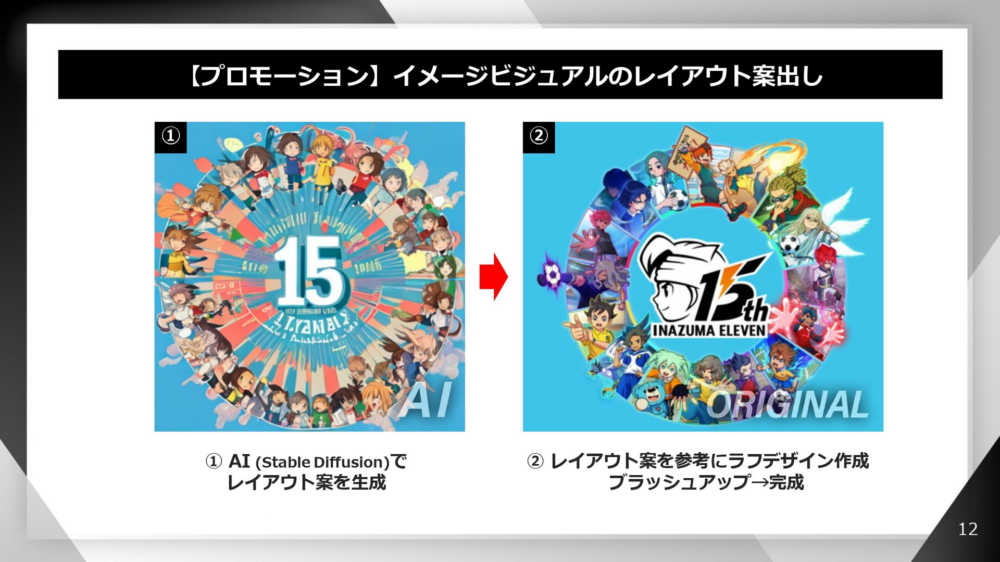

**Reflexión final**

Desde flamaclothing, consideramos que a futuro, puede que más gente use la IA como nosotros para poder asistir a sus diseños, como ya hacen otras empresas en sectores similares de diseños, por ejemplo, en videojuegos, Level 5 ha confirmado que usa IA para asistir a sus proyectos en relación a los diseños de personajes etc, esto al final no deja de estar dentro del sector de diseñación y también es un claro ejemplo de como implementar bien estas herramientas para hacer diseño sin perder un arte más coherente. Probablemente sea algo que se vaya viendo en más partes del sector de diseñadores poco a poco, ya que alivia bastante alguna carga de trabajo y ayuda a tener los mejores diseños posibles.

>Ejemplo de Level 5 usando IA (Fuentes:https://reflot.es/d/14483-la-desarrolladora-de-videojuegos-level-5-revela-como-utilizan-la-ia-generativa-con-stable-diffusion)